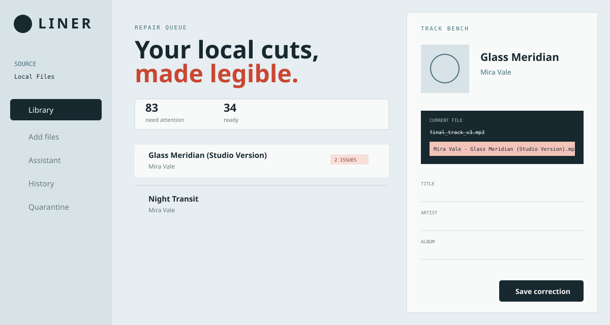

# Liner

Liner is a Windows-local workbench for repairing and managing audio files used by
Spotify Local Files. It scans a configured folder, exposes the collection only at
`http://127.0.0.1:8764`, and provides safe metadata editing, filename cleanup,
artwork replacement, audio preview, uploads, quarantine/restore, history, optional
AI planning, and optional MeTube-sidecar ingestion.



## Safety model

- Liner binds only to IPv4 loopback and validates the HTTP `Host` header.
- Every browser mutation requires a process-local request token and same-origin request.
- Browser requests use opaque track IDs; absolute paths are never accepted by the API.
- Library operations reject path traversal and Windows reparse points.
- Tag and artwork edits first create a backup, write and validate a temporary copy,
  then atomically replace the source file.
- Deletion first moves a file to Liner's private quarantine. Permanent deletion is
  available only from quarantine and requires browser confirmation.
- AI can return schema-validated correction plans only. It cannot run commands,
  browse the filesystem, download files, or apply a plan without user confirmation.
- Runtime data and credentials live outside Git under the current user's application
  data directory or local environment.

Liner does not modify a track during scanning. Spotify may treat changes to artist,
album, title, or duration as a new local-track identity, so edits can invalidate
existing local playlist entries.

## Requirements

- Windows 10 or 11
- Python 3.12 or newer
- [uv](https://docs.astral.sh/uv/)
- Node.js 22 or newer for building the bundled interface
- FFmpeg is recommended for validating broad media compatibility and required by the
  synthetic test suite

## Install

From PowerShell in the repository:

```powershell
.\scripts\Install-Liner.ps1
```

The installer creates an isolated Python environment, builds the interface, adds a
Start Menu shortcut, starts Liner at sign-in, launches the local service, and opens
the browser. It does not require administrator privileges or create a firewall rule.

To install without sign-in startup or immediate launch:

```powershell
.\scripts\Install-Liner.ps1 -NoStartup -NoLaunch
```

Uninstall shortcuts and stop the local process while preserving data:

```powershell
.\scripts\Uninstall-Liner.ps1
```

Add `-RemoveData` only when backups, quarantine, history, and configuration should
also be permanently removed.

## Configuration

Liner defaults to `%USERPROFILE%\Music\Local Files`. Copy `.env.example` to `.env`
only when an override or optional integration is needed. `.env` is ignored by Git.

| Variable | Purpose |
| --- | --- |
| `LINER_LIBRARY_ROOT` | Override the local audio source folder |
| `LINER_PORT` | Override loopback port `8764` |
| `LINER_AI_BASE_URL` | OpenAI-compatible API base URL |
| `LINER_AI_MODEL` | Model identifier |
| `LINER_AI_API_KEY` | Local AI credential |
| `LINER_METUBE_SIDECAR_URL` | Fixed MeTube-sidecar origin |
| `LINER_METUBE_CF_CLIENT_ID` | Optional Cloudflare service-token ID |
| `LINER_METUBE_CF_CLIENT_SECRET` | Optional Cloudflare service-token secret |
| `LINER_METUBE_API_KEY` | Optional sidecar defense-in-depth key |

AI requests transmit the selected tracks' filenames, tags, format, duration, and
issue labels to the configured provider. Audio and artwork are never sent.

## Development

```powershell
uv sync --extra dev
uv run pytest
uv run ruff check src tests
uv run ruff format --check src tests

Set-Location frontend
npm ci
npm run build
```

Run the built release locally:

```powershell
uv run liner
```

The React build is written into `src/liner/static` and included in the Python package.
All test audio is generated synthetically at test time; the repository contains no
personal or copyrighted media.

## Data and recovery

Runtime state is stored under `%LOCALAPPDATA%\Liner`:

| Directory | Content |
| --- | --- |
| `liner.sqlite3` | Index, plans, operations, and download jobs |
| `backups` | Pre-edit originals used by Undo |
| `quarantine` | Files removed from the active Spotify source |
| `staging` | Temporary, bounded uploads |

Backups and quarantine can consume significant disk space. They are intentionally not
automatic backup software; include them in a separate backup policy if needed.

## License

[MIT](LICENSE)
